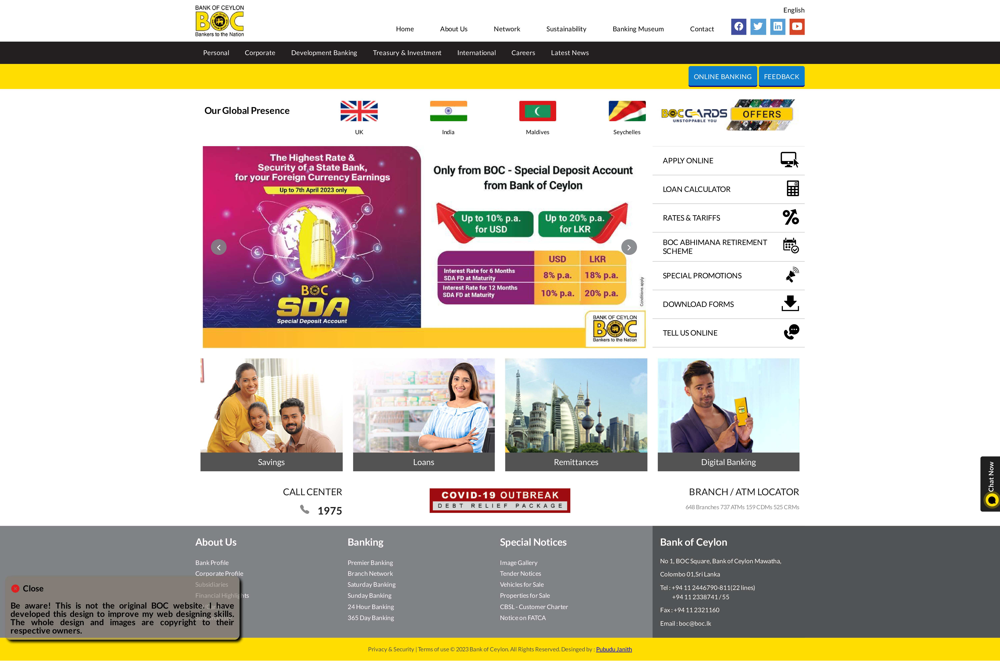

# BOC Homepage Clone 

### Static design of the Bank of Ceylon homepage

The [**BOC homepage**](https://www.boc.lk/) was designed in order to practice and develop the web design skills. 
This webpage was developed using pure HTML and CSS technologies. 
It was developed as a **static website** for desktop view only.

The main aspects focused on creating the webpage were **CSS box model, 
CSS text / font / icon styles, CSS positions, CSS float, CSS inline blocks, CSS pseudo-classes and basic HTML and CSS syntax.**

### Image of the cloned homepage
 

## Used Technologies

- HTML5
- CSS3

#### Used Source-Code Editor
- Visual Studio Code

## How to use ?
This project can be used by cloning the
project to your local machine.

1. Clone the project using `https://github.com/PubuduJ/boc-homepage-clone.git` terminal command.
2. Open the project from **Visual Studio Code**.
3. Run the project using **Live Server**
- Live server can be installed to the VS Code as an extension. Get more details about the Live Server from [Visual Studio Marketplace](https://marketplace.visualstudio.com/items?itemName=ritwickdey.LiveServer).

## Credits
This project was carried out under the guidance of the [IJSE](https://www.ijse.lk/) Direct Entry Program 9.

## License
Copyright &copy; 2023 [Pubudu Janith](https://www.linkedin.com/in/pubudujanith94/). All Rights Reserved. 
This project is licensed and source code is available to all under the [MIT license](LICENSE.txt).